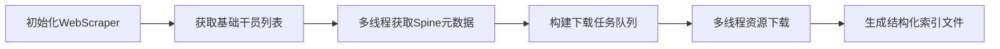
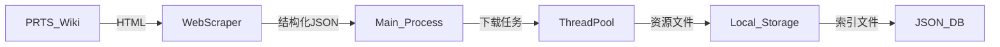
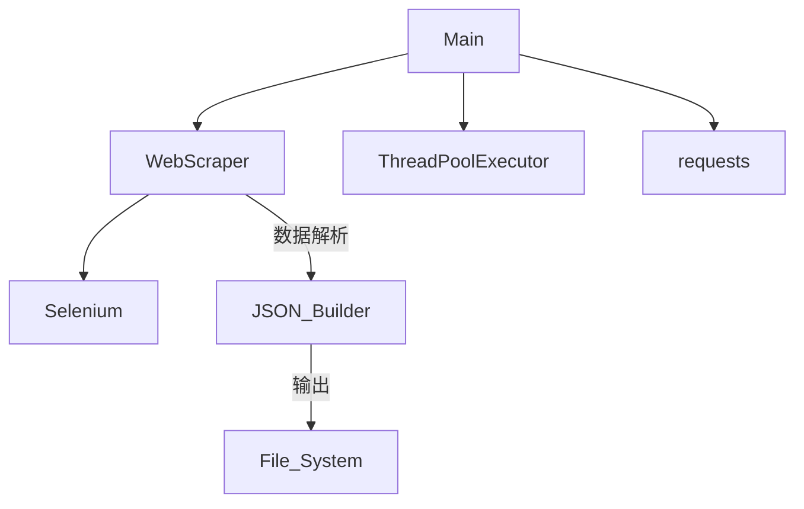

# PRTS 数据采集与资源下载工具

## 项目概述
本项目是一个针对《明日方舟》游戏资料站（PRTS Wiki）的数据采集与资源下载工具集，包含网页数据抓取、结构化数据解析、多线程资源下载等功能模块。通过自动化流程实现游戏角色资料、美术资源、剧情文本等内容的批量获取与存储。

---

## 工具模块说明 (SimulationTool)

### WebScraper 核心类
```python
class WebScraper:
    """基于 Selenium 的网页自动化采集工具"""
```

#### 主要功能方法

| 方法名称                  | 功能描述                                                                 |
|--------------------------|--------------------------------------------------------------------------|
| `get_all_agent_head_normal` | 获取全干员基础头像信息（默认皮肤）                                       |
| `get_one_agent_spines`    | 获取单个干员的所有 Spine 动画资源元数据                                  |
| `get_one_agent_voices`    | 采集干员语音资源信息                                                     |
| `get_one_agent_records`   | 获取干员档案/模组/悖论模拟等结构化数据                                   |
| `get_main_story_list`     | 抓取主线剧情与活动剧情目录结构                                           |
| `get_skin_brand_list`     | 获取时装品牌回廊信息                                                     |
| `get_side_story_lite`     | 采集情报处理室的公共事务实录数据                                         |


## 主程序功能 (main.py)

### 核心流程


### **第一阶段：数据采集与处理**
1. **初始化配置**
   - 禁用SSL警告（避免证书验证问题）
   - 创建持久HTTP会话 (`requests.Session`)
   - 设置浏览器UA头绕过简单反爬

2. **多线程爬取角色数据**
   - 使用`WebScraper`工具获取所有角色的基础信息 (`agents`)
   - 通过8线程并发调用`process_agent_spines`函数：
     - 对每个角色调用`get_one_agent_spines`获取详细的骨骼动画(spine)数据
     - 失败自动重试直到成功
   - 最终数据保存到`data.json`

### **第二阶段：资源下载**
1. **任务生成**
   - 解析处理后的角色数据（含头部和骨骼动画URL）
   - 为每个角色生成两类下载任务：
     - **头部资源**：直接下载PNG图片
     - **骨骼动画**：下载关联的三类文件（.png纹理、.skel骨骼数据、.atlas图集）
   - 支持`filter`参数选择性下载特定模型

2. **高速下载引擎**
   - 使用32线程并发下载（`ThreadPoolExecutor`）
   - 自动创建目录结构（如`saves/角色名/head/...`）
   - 实时进度条显示（`tqdm`）
   - 失败自动重试机制
   - 下载结果映射保存到`saves.json`

---

## 数据结构说明

### 干员数据结构
```python
agent = {
    "name": "干员名称",
    "head": {
        "皮肤名称": "图片URL",
        ...
    },
    "spine": {
        "动画类型": {
            "模型名称": "资源基础路径",
            ...
        },
        ...
    }
}
```

### 资源索引结构
```javascript
{
  "干员名称": {
    "head": {
      "皮肤名称": "本地存储路径",
      ...
    },
    "spine": {
      "动画类型": {
        "模型名称": {
          "png": "png文件路径",
          "skel": "骨骼文件路径",
          "atlas": "图集文件路径"
        },
        ...
      },
      ...
    }
  },
  ...
}
```

---

## 系统架构图

### 数据流图


### 模块调用关系


---

## 使用指南

1. **环境准备**
   ```bash
   pip install selenium requests urllib3 tqdm
   ```

2. **执行主程序**
   ```python
   python main.py
   ```

3. **输出结构**
   ```
   project_root/
   ├── data.json         # 原始元数据
   ├── saves.json        # 资源索引文件
   └── saves/            # 资源存储目录
       ├── 干员A/
       │   ├── head/
       │   └── spine/
       └── 干员B/
           ├── head/
           └── spine/
   ```

---

## SimulationTool 各功能函数数据结构详解

### 1. get_all_agent_head_normal()
```python
返回类型: List[agent]
数据结构:
[
  {
    "name": "干员名称",
    "head": {
      "默认": "URL"
    },
    "spine": {
      # 空占位符
    }             
  },
  ...
]
```

### 2. get_one_agent_spines(agent, session, headers)
```python
输入参数: agent 基础对象
返回结构更新:
{
  "name": "妮芙",
  "head": {
    "默认": "URL",
    "甜美配方": "URL"
    ...
  },
  "spine": {
    "默认": {
      "正面": "URL",
      "基建": "URL"
      ...
      },
    "甜美配方": {
      "正面": "URL",
      "基建": "URL"
      ...
    }
    ...
  }
},
```

### 3. get_one_agent_voices(name)
```python
返回类型: Dict
数据结构:
{
  "语音标题": {
    "text": {
      "语音类型": "文本内容",
      ...
    },
    "link": {
      "语音类型": "音频URL",
      ...
    }
  },
  ...
}
```

### 4. get_one_agent_records(name)
```python
返回类型: Dict
数据结构:
{
  "立绘": {
    "立绘名称1": "URL",
    "立绘名称2": "URL",
    ...
  },
  "模组剧情": {
    "模组名称1": "描述文本",
    "模组名称2": "描述文本",
    ...
  },
  "相关道具": {
    "招聘合同": "描述文本",
    "信物": "描述文本"
  },
  "干员档案": {
    "档案分类1": "档案内容",
    "档案分类2": "档案内容",
    ...
  },
  "悖论模拟": {
    "模拟标题": "剧情文本内容"
  },
  "干员密录": [
    {
      "title": "标题",
      "poem": "箴言",
      "link": "URL"
    },
    ...
  ]
}
```

### 5. get_main_story_list()
```python
返回类型: Dict
数据结构:
{
  "活动名称": [
    {
      "title": "怒号光明",
      "classify": "主线",
      "story": [
        {
          "name": "R8-1 昨日，谷壳将裂 行动前",
          "link": "剧情页URL"
        },
        ...
      ]
    },
    ...
  ],
  ...
}
```

### 6. get_skin_brand_list()
```python
返回类型: Dict
数据结构:
{
  "品牌名称": "URL",
  "品牌名称": "URL",
  ...
}
```

### 7. get_one_brand_infor(link)
```python
返回类型: Dict
数据结构:
{
  "皮肤名称": {
    "描述": [
      "第一段描述文本",
      "第二段内容...",
    ],
    "注释": [
      "第一段描述文本",
      "第二段内容...",
    ]
  },
  ...
}
```

### 8. get_side_story_lite()
```python
返回类型: Dict
数据结构:
{
  "活动标题": [
    {
      "tag": "GT-1",
      "name": "日正当中",
      "time": "行动前",
      "content": "因为宝藏传说而动荡不安的滴水村..."
    },
    ...
  ],
  ...
}
```

### 9. get_one_story_page(link)
```python
返回类型: Dict
数据结构:
{
  "故事标题": [
    {
      "type": "normal",       # 类型：normal/choice/single
      "dialogue": {
        "by": "说话角色",      # 如 "阿米娅"
        "text": "对话内容"
      }
    },
    {
      "type": "choice",
      "dialogue": [
        # 分支选择一
        [
          {"by": "Dr.", "text": "选项文本"},
          {"by": "角色A", "text": "回应内容"},
          ...
        ],
        # 分支选择二
        [
          {"by": "Dr.", "text": "选项文本"},
          {"by": "角色A", "text": "回应内容"},
          ...
        ],
        ...
      ]
    },
    ...
  ]
}
```
